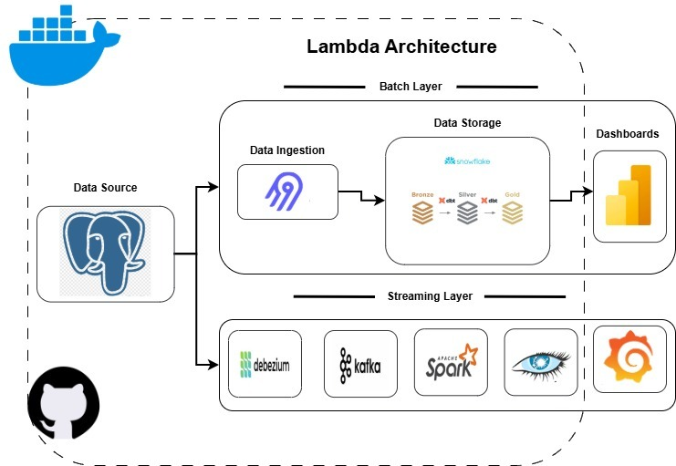
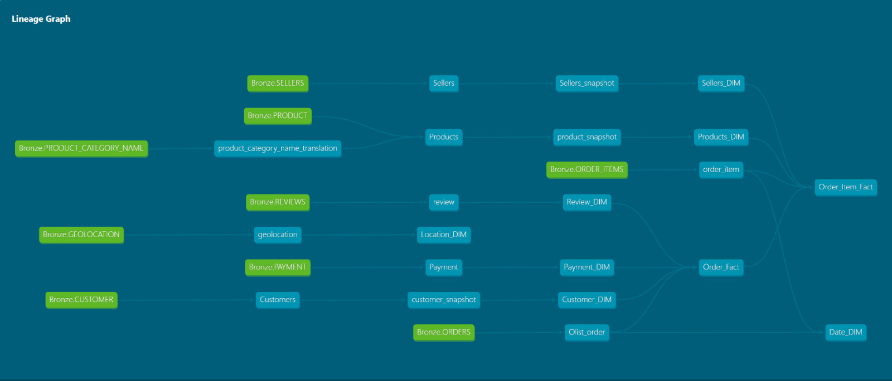
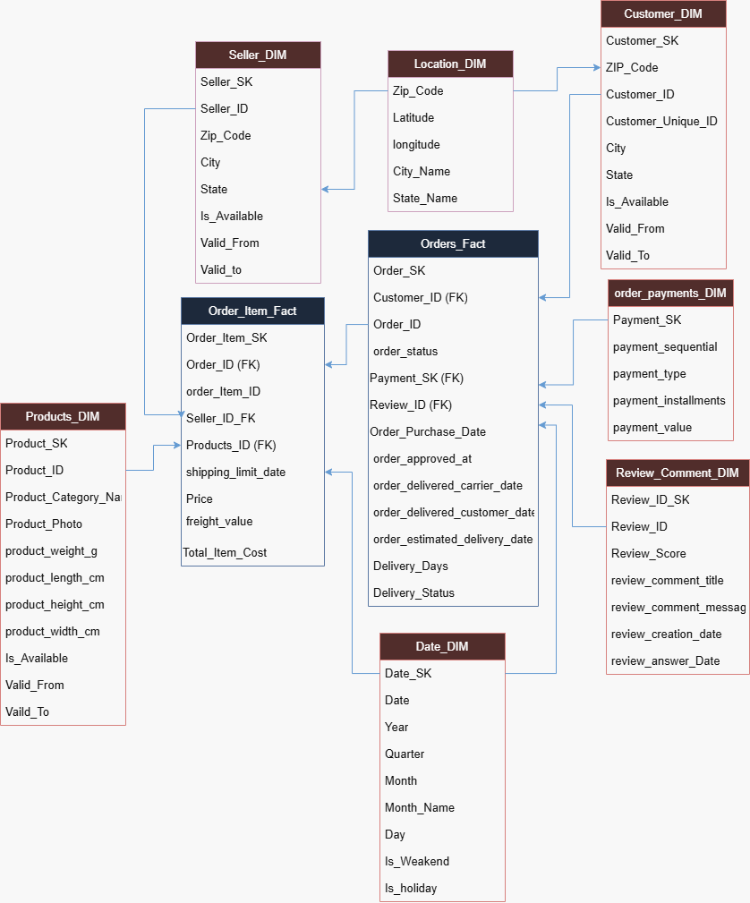
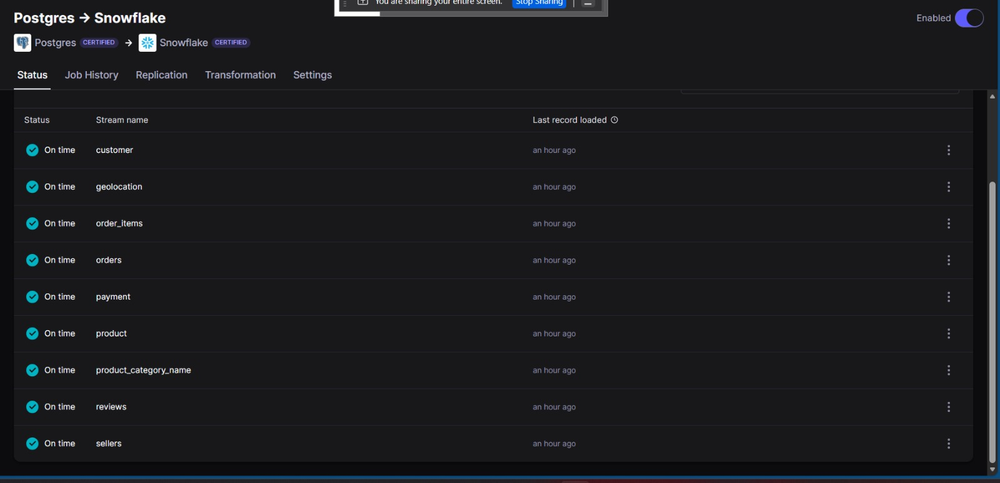
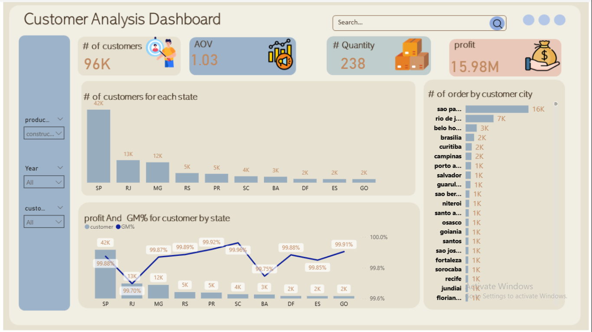
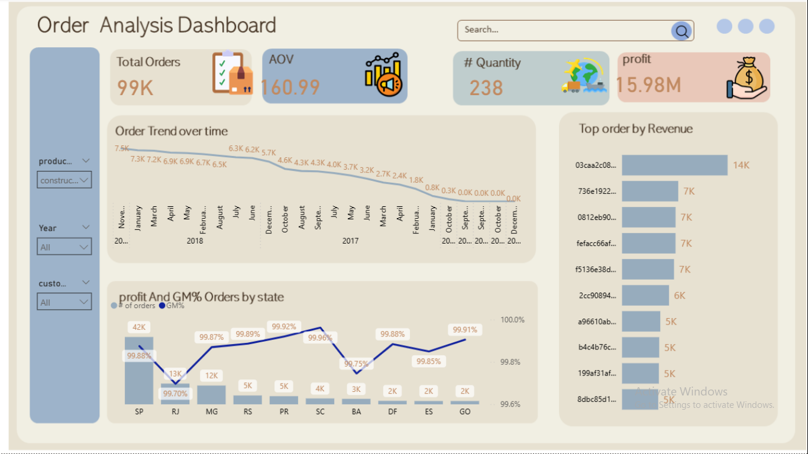

# Olist E-Commerce Data Pipeline Project 🚀

## Project Overview
This project implements a complete End-to-End Data Engineering Pipeline for the Olist E-Commerce dataset. The goal is to build a robust Lambda Architecture that handles data ingestion, transformation, and visualization to provide business insights into sales, customers, and delivery performance.

## Architecture
## The project follows a modern data stack approach as shown in the workflow:

## ⚡ Batch Layer (Historical Pipeline)

Data Source: PostgreSQL Database containing the raw Olist dataset.
Data Ingestion: Using Airbyte to extract data from Postgres and load it into the Data Warehouse.
Data Transformation: Using dbt (data build tool) to create Bronze, Silver, and Gold layers (Medallion Architecture) within the warehouse.
Data Storage: Snowflake / PostgreSQL (Warehouse layer).
Visualization: Power BI / Metabase dashboards for business reporting.

## Project Structure

The repository is organized as follows:
airbyte/: Contains configuration files, Docker Compose, and connection settings for data synchronization.
dbt/: Contains the transformation logic:
models/bronze/: Raw data staging.
models/silver/: Cleaned and standardized data.
models/gold/: Business-ready fact and dimension tables.
Postgres_SQL/: SQL scripts for database initialization and schema setup.

## How to Run the Project

1. Prerequisites
Docker & Docker Compose.
Python 3.x (for dbt).
PostgreSQL instance.

2. Setting up Airbyte
Navigate to the airbyte folder: cd airbyte
Launch Airbyte: docker-compose up
Access the UI at http://localhost:8000 and set up the source (Postgres) and destination.

3. Data Transformation with dbt
Navigate to the dbt folder: cd dbt
Install dependencies: dbt deps
Run transformations: dbt run

Key Performance Indicators (KPIs) tracked:

## Dashboards

## ⚡ Streaming Layer (Real-Time Pipeline)

To complement the Batch layer, this project implements a Streaming Layer designed for real-time data processing and low-latency insights.

## Tech Stack:
Debezium: Used for Change Data Capture (CDC) from the source PostgreSQL database to capture every row-level change (Insert/Update/Delete).
Apache Kafka: Acts as the high-throughput distributed messaging backbone, streaming events from Debezium to downstream consumers.
Apache Spark: Processes streaming data in real-time to perform windowed aggregations and immediate transformations.
Grafana: Provides real-time monitoring and observability of the streaming metrics and data flow.

## How it works:

Capture: Debezium monitors the Postgres WAL (Write Ahead Log) and publishes events to Kafka topics.
Process: Spark Structured Streaming consumes these topics, cleaning and enriching the data on the fly.
Serve: The processed stream is pushed to the Gold layer or directly to real-time dashboards for immediate visibility.

## Future Improvements
Implement a Streaming Layer using Apache Kafka and Spark as per the Lambda Architecture design.

## 👥 The Team
This project was developed as a collaborative effort by a dedicated Data Engineering team. Special thanks to all team members for their contributions:

Mahmmoud Saad  | [🔗 LinkedIn](https://www.linkedin.com/in/mahmoud-saad-8540b63a0) |

Omar Yehia   | [🔗 LinkedIn](https://www.linkedin.com/in/omaryahia-/) |

Nora Magdy  | [🔗 LinkedIn](https://www.linkedin.com/in/noramagdy) |

Rehab Ramadan   | [🔗 LinkedIn](https://www.linkedin.com/in/rehab-ramadan-917027212?utm_source=share&utm_campaign=share_via&utm_content=profile&utm_medium=android_app) |

Abdallah Fathi  | [🔗 LinkedIn](https://www.linkedin.com/in/abdullah-fathy/) |

Anhar Mohamed  | [🔗 LinkedIn](https://www.linkedin.com/in/anhar-mohamed2/) |

